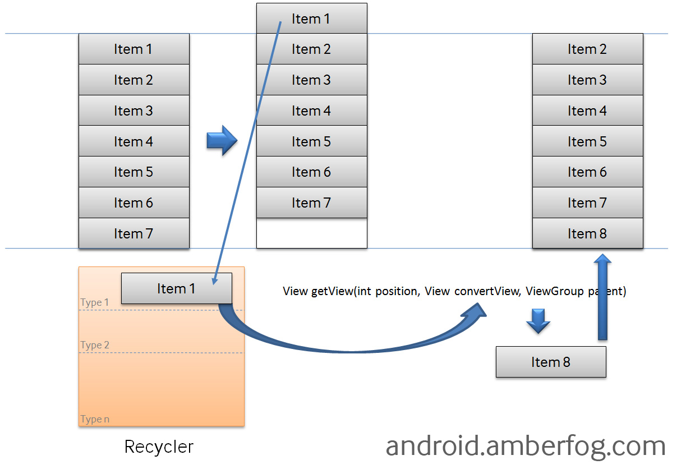

#1.Android 系统架构

系统应用，
应用框架Java Framework (Application frameworks),
系统运行库和安卓运行环境 c/c++ & ART,
硬件抽象层 HAL,
Linux 内核 Linux Kernel 基于Linux 2.6

# 2.Activity
 Activity 生命周期 
           
          正常 onCreate() onRestart() onStart() onResume() onPause() onStop() onDestroy()
          onCreate()中调用finish()方法，系统立刻调用onDestroy()不调用其他生命周期方法
          异常 系统配置发生更改 横 1 竖 2屏切换  语言 onConfigChange()
               内存回收低优先级activity被回收
               onStop() 之前 onSaveInstanceState() onStart()之后 onRestoreInstanceState()
 Activity 启动模式
    launchMode 若服用Activity则调用onNewIntent()方法
        标准模式standard 每次启动Activity不管Activity是否在栈内存在，都会创建新的实例并压入栈顶。 
      谁启动就入谁的栈
        栈顶模式singleTop 若在栈顶存在需启动的Activity则回调用onNewIntent()方法，否则和standard一样。
      谁启动就入谁的栈
        栈内模式singleTask 首先确认所需的栈是否创建，若栈存在，判断栈内是否存在该Activity，若存在就将其
      调到栈顶回调onNewIntent()，并将其上的实例出栈，否则创建实例并入栈。若栈没有创建，直接创建栈放入Activity。
        单实例模式singleInstance 只能单独存在于一个任务栈中
        
 Intent 常用flag
  FLAG_ACTIVITY_NEWTASK
  FLAG_ACTIVITY_SINGLETOP
  FLAG_ACTIVITY_CLEARTOP
  FLAG_ACTIVITY_EXCLUDE_RECENT
  
  Activity view 和 window 关系
  启动activity 创建window, phoneWindow 包含一个DecorView, DecorView继承自FrameLayout, addView()添加view

# 3.Service 生命周期
 Service startService() onCreate() onStartCommand() onDestroy()
         bindService()  onCreate() onBind() onUnbind() onDestroy()
 长活 onStartCommand() 中返回 START_STICKY START_IMMEDITENLY
      startForegroundService() 开启前台进程
      注册广播监听onDestroy()   
      提高service优先级别1--10000    

# 4.BroadcastReceiver 广播机制
   静态注册 动态注册
   有序广播，一般广播， 粘连广播
   
# 5.ContentProvider  
 onCreate()
 onInsert()
 onQuery()
 onUpdate()
 onDelete()
 onDescription() 
   
# 6:IPC(inner process communication)进程间通信
    Intent 
    File 共享
    AIDL   
    ContentProvider
    Socket
# 7.Fragment 
    Fragment生命周期 onAttach() onCreate() onActivityCreate() onCreateView() onStart() onResume()
                     onPause()  onStop() onDestroyView() onDestroy() onDetach()
    静态加载  <fragment/>
    动态加载  FragmentManager FragmentTransaction                  
    
# 7.View 绘制过程
  常用布局  FrameLayout RelativeLayout LinearLayout TableLayout(TableRow) AbsoluteLayout
  onMeasure()
  onLayout()
  onDraw()

# 8.ListView原理及优化
  
  优化，针对适配器复用View
        针对Bitmap优化，ImageLoader

  事件分发机制
   dispatchTouchEvent() onInterceptTouchEvent() onTouchEvent()
  
   requestDisallowInterceptTouchEvent()
   
  伪代码
  public void dispatchTouchEvent(MotionEvent event) {
    boolean consume = false;
    if(onInterceptTouchEvent()) {
        consume = onTouchEvent(event);
    } else {
        consume = child.dispatchTouchEvent(event);
    }
    return consume;
  }
  滑动冲突 
  
# 9.Handler机制
  handler message  messageQueue looper
  
# 10.性能优化
  布局优化 merge include viewStub
  Bitmap 采样， 三级缓存加载
  内存泄漏 
  
# 11.常用框架，第三方相关库
 mvc mvp mvvm
 图片 glide 
 动画 nineoldanim
 网络 okhttp retrofit
 数据库 greendao
 地图 gaode 
 异常检测 umeng 推送 小米/华为单独处理
 异步 eventbus rxandroid
 
  
    

