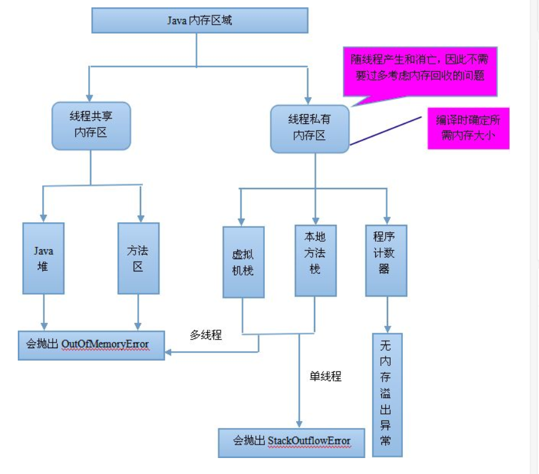

# 高司令 基础 
编译型语言如C、C++，代码是直接编译成机器码执行，但是不同的平台（x86、ARM等）CPU的指令集不同，因此，需要编译出每一种平台的对应机器码。

解释型语言如Python、Ruby没有这个问题，可以由解释器直接加载源码然后运行，代价是运行效率太低。

面向对象编程，是一种通过对象的方式，把现实世界映射到计算机模型的一种编程方法。
面向过程 

计算机内存的最小存储单元是字节（byte），一个字节就是一个8位二进制数，即8个bit。

JDK：Java Development Kit
JRE：Java Runtime Environment

JSR规范：Java Specification Request        RI：Reference Implementation
                                        TCK：Technology Compatibility Kit
JCP组织：Java Community Process

IDE是集成开发环境：Integrated Development Environment的缩写。

OOP 面向对象编程，英文是Object-Oriented Programming

Java规定，某个类定义的public static void main(String[] args)是Java程序的固定入口方法，因此，Java程序总是从main方法开始执行。

一个Java源码只能定义一个public类型的class，并且class名称和文件名要完全一致；

类名必须以英文字母开头，后接字母，数字和下划线的组合
方法名也有命名规则，命名和class一样，但是首字母小写

基本数据类型是CPU可以直接进行运算的类型 byte short int long  float double char boolean

如果有局部变量和字段重名，那么局部变量优先级更高，就必须加上this

基本类型参数的传递，是调用方值的复制。双方各自的后续修改，互不影响
引用类型参数的传递，调用方的变量，和接收方的参数变量，指向的是同一个对象。双方任意一方对这个对象的修改，都会影响对方（因为指向同一个对象嘛）

如果我们自定义了一个构造方法，那么，编译器就不再自动创建默认构造方法

# 概念

超类（super class），父类（parent class），基类（base class）
类（subclass），扩展类（extended class）

向上转型（upcasting）向下转型（downcasting）

覆写（Override） 重载（overload)

多态（Polymorphic）

Java的接口特指interface的定义，表示一个接口类型和一组方法签名，而编程接口泛指接口规范，如方法签名，数据格式，网络协议等

Epoch Time(时间戳)是计算从1970年1月1日零点（格林威治时区／GMT+00:00）到现在所经历的秒数

# 常识

通常JVM内部会把boolean表示为4字节整数。

整数的除法对于除数为0时运行时将报错，但编译不会报错。

++写在前面和后面计算结果是不同的，++n表示先加1再引用n，n++表示先引用n再加1。不建议把++运算混入到常规运算中，容易自己把自己搞懵了

如果对一个负数进行右移，最高位的1不动，结果仍然是一个负数
不带符号的右移运算，使用>>>，它的特点是符号位跟着动，因此，对一个负数进行>>>右移，它会变成正数，原因是最高位的1变成了0

对byte和short类型进行移位时，会首先转换为int再进行位移。

由于浮点数存在运算误差，所以比较两个浮点数是否相等常常会出现错误的结果。正确的比较方法是判断两个浮点数之差的绝对值是否小于一个很小的数

需要特别注意，在一个复杂的四则运算中，两个整数的运算不会出现自动提升的情况

Java在内存中总是使用Unicode表示字符，所以，一个英文字符和一个中文字符都用一个char类型表示，它们都占用两个字节

Java的字符串除了是一个引用类型外，还有个重要特点，就是字符串不可变（改变的是引用），字符串的不可变是指字符串内容不可变。
字符串在String内部是通过一个char[]数组表示的
要特别注意，Integer有个getInteger(String)方法，它不是将字符串转换为int，而是把该字符串对应的系统变量转换为Integer

数组一旦创建后，大小就不可改变（和String 类似只是引用发生更改）

由于%表示占位符，因此，连续两个%%表示一个%字符本身。

要判断引用类型的变量内容是否相等，必须使用equals()方法

class是一种对象模版，它定义了如何创建实例，因此，class本身就是一种数据类型

这是因为在Java中，任何class的构造方法，第一行语句必须是调用父类的构造方法。如果没有明确地调用父类的构造方法，编译器会帮我们自动加一句super();
如果父类没有默认的构造方法，子类就必须显式调用super()并给出参数以便让编译器定位到父类的一个合适的构造方法。
即子类不会继承任何父类的构造方法。子类默认的构造方法是编译器自动生成的，不是继承的。

方法名相同，方法参数相同，但方法返回值不同，也是不同的方法。在Java程序中，出现这种情况，编译器会报错。

Java的实例方法调用是基于运行时的实际类型的动态调用，而非变量的声明类型

包没有父子关系。java.util和java.util.zip是不同的包，两者没有任何继承关系。

classpath是JVM用到的一个环境变量，它用来指示JVM如何搜索class。

出现了UTF-8编码，它是一种变长编码，用来把固定长度的Unicode编码变成1～4字节的变长编码。
# 接口
 1.接口中声明的成员默认为static final成员（不管是基础数据类型还是引用类型），且必须初始化； 
 2.接口中声明的方法默认为public且不能有实现体，即｛｝，方法体可有参数； 
 3.实现接口的类，必须实现接口中所有方法，且不能降低方法的运用域，即必须显示声明为public 
 4,抽象类不需要实现接口的方法。抽象类也可以实现接口，但是可以实现部分或者一个都不实现。 
 5,在jdk8之后添加了默认方法，在返回值加上default关键字，然后还有方法体;该接口被扩展时，可以直接继承
 或重新声明。还添加了静态方法。
 
 一般来说，公共逻辑适合放在abstract class中，具体逻辑放到各个子类，而接口层次代表抽象程度。

#  继承
 1、Java 中单实现通过 implements 关键字，多实现通过 extends 关键字
 
 2、Java 中单继承通过 extends 关键字，没有多继承
 
 3、如果同时出现继承和实现，则必须先继承（extends）再实现（implements）
 
# 编译
 编译器将Java源代码编译成字节码class文件
 类加载到JVM里面后，执行引擎把字节码转为可执行代码
 执行的过程，再把可执行代码转为机器码，由底层的操作系统完成执行。
 
# 运行
 运行时数据区包括：程序计数器、虚拟机栈、本地方法栈、Java堆、方法区以及方法区中的运行时常量池
 
 
 1、程序计数器： 线程私有，是当前线程所执行的字节码的行号指示器，如果线程正执行一个java方法，计数器记录
 正在执行的虚拟机字节码指令的地址，如果线程正在执行的是Native方法，则计数器值为空；
 
 2、虚拟机栈： 即栈区， 线程私有 ，为虚拟机执行 Java 方法（字节码）服务，每个方法在执行的时会创建一个
 栈帧用于存放局部变量表、操作数栈、动态链接和方法出口等信息，每个方法的调用直至执行完成对应于栈帧的入栈
 和出栈；
 
 3、本地方法栈： 为虚拟机使用的 Native 方法服务，也是 线程私有 ；
 
 4、Java 堆： 在虚拟机启动时创建， 线程共享 ，唯一目的是存放对象实例，是垃圾收集器管理的主要区域——”
  GC 堆“，可以细分为新生代和老年代，新生代又可以细分为 Eden 空间、 From Survivor 空间和 To Survivor 空
  间；物理上可以不连续，但逻辑上连续，可以选择固定大小或者扩展；
 
 5、方法区： 线程共享 ，用于存储被虚拟机加载的类信息、常量、静态变量、即时编译器编译后的代码等数据。
 被称为“永久代”，是因为 HotSpot 虚拟机的设计团队把 GC 分代收集扩展到方法区，即使用永久代来实现方法
 区，像 GC 管理 Java 堆一样管理方法区，从而省去专门为方法区编写内存管理代码，内存回收目标是针对常量池
 的回收和堆类型的卸载；
 
 6、运行时常量池： 线程共享 ，是方法区的一部分， Class 文件中存放编译期生成的各种字面量和符号引用，类
 加载后进入方法区的运行时常量池中。
 
 JAVA的JVM的内存可分为3个区：堆(heap)、栈(stack)和方法区(method)
 栈区:
 每个线程包含一个栈区，栈中只保存方法中（不包括对象的成员变量）的基础数据类型和自定义对象的引用(不是对象)，
 对象都存放在堆区中
 每个栈中的数据(原始类型和对象引用)都是私有的，其他栈不能访问。
 栈分为3个部分：基本类型变量区、执行环境上下文、操作指令区(存放操作指令)。
 堆区:
 存储的全部是对象实例，每个对象都包含一个与之对应的class的信息(class信息存放在方法区)。
 jvm只有一个堆区(heap)被所有线程共享，堆中不存放基本类型和对象引用，只存放对象本身，几乎所有的对象实
 例和数组都在堆中分配。
 方法区:
 又叫静态区，跟堆一样，被所有的线程共享。它用于存储已经被虚拟机加载的类信息、常量、静态变量、即时编译
 器编译后的代码等数据。
 
#  I/O
 input和output指的是对于程序而言。input是从文件读取进来，output是输出到文件。
 
 
 反序列化时不调用构造方法，可设置serialVersionUID作为版本号（非必需）
# servlet(Server Applet) 

 Servlet（Server Applet）是Java Servlet的简称，称为小服务程序或服务连接器，用Java编写的服务器端程序，
 具有独立于平台和协议的特性，主要功能在于交互式地浏览和生成数据，生成动态Web内容。
 
 Servlet的生命周期分为5个阶段：加载、创建、初始化、处理客户请求、卸载。
 (1)加载：Servlet容器（Tomcat）通过类加载器加载servlet文件（.class）
 (2)创建：通过调用servlet构造函数创建一个servlet对象
 (3)初始化：调用init方法初始化
 (4)处理客户请求：每当有一个客户请求，容器会创建一个线程来处理客户请求
 (5)卸载：调用destroy方法让servlet自己释放其占用的资源
 servlet是由Servlet容器负责加载Servlet类，创建Servlet对象并实例化，然后调用Servlet的init方法，进行初始
 化，之后调用Service方法。实例化和初始化不同。先实例化，再初始化。
 
# HashMap & HashTable

 1.  关于HashMap的一些说法：
  a)  HashMap实际上是一个“链表散列”的数据结构，即数组和链表的结合体。HashMap的底层结构是一个数组，数组
  中的每一项是一条链表。 
  b)  HashMap的实例有俩个参数影响其性能： “初始容量” 和 装填因子。 
  c)  HashMap实现不同步，线程不安全。  HashTable线程安全 
  d)  HashMap中的key-value都是存储在Entry中的。 
  e)  HashMap可以存null键和null值，不保证元素的顺序恒久不变，它的底层使用的是数组和链表，通过hashCode()
  方法和equals方法保证键的唯一性 
  f)  解决冲突主要有三种方法：定址法，拉链法，再散列法。HashMap是采用拉链法解决哈希冲突的。 
  注： 链表法是将相同hash值的对象组成一个链表放在hash值对应的槽位；   
   用开放定址法解决冲突的做法是：当冲突发生时，使用某种探查(亦称探测)技术在散列表中形成一个探查(测)序列。 
   沿此序列逐个单元地查找，直到找到给定 的关键字，或者碰到一个开放的地址(即该地址单元为空)为止（若要插入，
   在探查到开放的地址，则可将待插入的新结点存人该地址单元）。  
  拉链法解决冲突的做法是： 将所有关键字为同义词的结点链接在同一个单链表中 。若选定的散列表长度为m，则可
 将散列表定义为一个由m个头指针组成的指针数 组T[0..m-1]。凡是散列地址为i的结点，均插入到以T[i]为头指针的
 单链表中。T中各分量的初值均应为空指针。在拉链法中，装填因子α可以大于1，但一般均取α≤1。拉链法适合未
 规定元素的大小。    
 2.  Hashtable和HashMap的区别： 
  a)   继承不同。 
  public class Hashtable extends Dictionary implements Map 
  public class HashMap extends  AbstractMap implements Map 
  b)  Hashtable中的方法是同步的，而HashMap中的方法在缺省情况下是非同步的。在多线程并发的环境下，可以直
  接使用Hashtable，但是要使用HashMap的话就要自己增加同步处理了。 
  c)  Hashtable 中， key 和 value 都不允许出现 null 值。 在 HashMap 中， null 可以作为键，这样的键只有
  一个；可以有一个或多个键所对应的值为 null 。当 get() 方法返回 null 值时，即可以表示 HashMap 中没有该键，
  也可以表示该键所对应的值为 null 。因此，在 HashMap 中不能由 get() 方法来判断 HashMap 中是否存在某个键，
   而应该用 containsKey() 方法来判断。 
   d)  两个遍历方式的内部实现上不同。Hashtable、HashMap都使用了Iterator。而由于历史原因，Hashtable还使用了
   Enumeration的方式 。 
   e)  哈希值的使用不同，HashTable直接使用对象的hashCode。而HashMap重新计算hash值。 
   f)  Hashtable和HashMap它们两个内部实现方式的数组的初始大小和扩容的方式。HashTable中hash数组默认大小是11，
   增加的方式是old*2+1。HashMap中hash数组的默认大小是16，而且一定是2的指数。  
    注：  HashSet子类依靠hashCode()和equal()方法来区分重复元素。      HashSet内部使用Map保存数据，即将
    HashSet的数据作为Map的key值保存，这也是HashSet中元素不能重复的原因。而Map中保存key值的,会去判断当前Map中
    是否含有该Key对象，内部是先通过key的hashCode,确定有相同的hashCode之后，再通过equals方法判断是否相同。 
    
# JDBC(java data base connection) java数据库连接
  [引用](https://www.cnblogs.com/erbing/p/5805727.html)
　JDBC是一种用于执行SQL语句的Java API，可以为多种关系数据库提供统一访问，它由一组用Java语言编写的类和接口组成。
JDBC提供了一种基准，据此可以构建更高级的工具和接口，使数据库开发人员能够编写数据库应用程序。

  加载JDBC驱动程序 → 建立数据库连接Connection → 创建执行SQL的语句Statement → 处理执行结果ResultSet → 释放资源
    
# 异常
checked exception：指的是编译时异常，该类异常需要本函数必须处理的，用try和catch处理，或者用throws抛出异常，
然后交给调用者去处理异常。
runtime exception：指的是运行时异常，该类异常不必须本函数必须处理，当然也可以处理。 

# AWT  

# 并发编程
线程优先级 1~10, 默认值5

在Java程序中，一个线程对象只能调用一次start()方法启动新线程，并在新线程中执行run()方法。一旦run()方法执行完毕，线程就结束了。

中断一个线程非常简单，只需要在其他线程中对目标线程调用interrupt()方法，目标线程需要反复检测自身状态是否是interrupted状态，如果是，就立刻结束运行。

线程间共享变量需要使用volatile关键字标记，确保每个线程都能读取到更新后的变量值

原子操作是指不能被中断的一个或一系列操作。

JVM允许同一个线程重复获取同一个锁，这种能被同一个线程反复获取的锁，就叫做可重入锁。

FixedRate是指任务总是以固定时间间隔触发，不管任务执行多长时间
FixedDelay是指，上一次任务执行完毕后，等待固定的时间间隔，再执行下一次任务
### 日期
yyyy：年
MM：月
dd: 日
HH: 小时
mm: 分钟
ss: 秒

### 测试（TDD)
单元测试就是针对最小的功能单元编写测试代码。Java程序最小的功能单元是方法，因此，对Java程序进行单元测
试就是针对单个Java方法的测试。

### 正则表达式

正则表达式是用字符串描述的一个匹配规则，使用正则表达式可以快速判断给定的字符串是否符合匹配规则。

正则表达式的匹配规则是从左到右按规则匹配。

 现在我们没办法用String.matches()这样简单的判断方法了，必须引入java.util.regex包，用Pattern对象匹配，匹配后获得一个Matcher对象，如果匹配成功，就可以直接从Matcher.group(index)返回子串
 
 正则表达式匹配默认使用贪婪匹配，可以使用?表示对某一规则进行非贪婪匹配。

"."匹配一个字符且仅限一个字符。
"\d"数字  "\s"空格 "\w"通用字符
"*"任意  "+" 至少一个 "?"零个 一个 "{n}"那个 "{n,m}"至少n个 至多m个（中间不存在空格）  "{n,}"至少n个
 用正则表达式进行多行匹配时，我们用^表示开头，$表示结尾。

### 函数式编程
函数式编程（Functional Programming）是把函数作为基本运算单元，函数可以作为变量，可以接收函数，还可以返回函数。